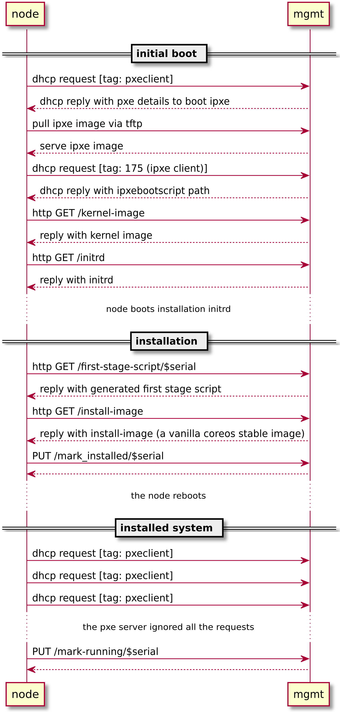

# Mayu Cluster Insides

Here we looking inside a deployed cluster. New nodes can be added to the
cluster at any time and the same bootstrap procedure will be applied. In this
example, we created a 4 node cluster:

```nohighlight
$ cd cluster
$ egrep -r 'Host|InternalAddr' */conf.json
004b27ed-692e-b32e-1f68-d89aff66c71b/conf.json:  "InternalAddr": "10.0.3.31",
004b27ed-692e-b32e-1f68-d89aff66c71b/conf.json:  "Hostname": "00006811af601fe8",
2843c49e-d1ba-6dd3-1320-d7cc82d8ea3a/conf.json:  "InternalAddr": "10.0.3.33",
2843c49e-d1ba-6dd3-1320-d7cc82d8ea3a/conf.json:  "Hostname": "0000906eb12096e3",
7100c054-d2c9-e299-b669-e8bdb85f6904/conf.json:  "InternalAddr": "10.0.3.32",
7100c054-d2c9-e299-b669-e8bdb85f6904/conf.json:  "Hostname": "0000d71391dc5317",
aa1f18e1-f14f-2dd9-4fa0-dae7317c712c/conf.json:  "InternalAddr": "10.0.3.34",
aa1f18e1-f14f-2dd9-4fa0-dae7317c712c/conf.json:  "Hostname": "0000b1895b74c624",
```

```nohighlight
$ ssh core@10.0.3.31 fleetctl list-machines -l
Warning: Permanently added '10.0.3.31' (ED25519) to the list of known hosts.
MACHINE         IP    METADATA
00006811af601fe8e1d3f37902021ae0  10.0.3.31 rule-core=true
0000906eb12096e3d94b002c663943f9  10.0.3.33 rule-core=true
0000b1895b74c624a51bd3b94d3adf3c  10.0.3.34 rule-worker=true,stack-compute=true
0000d71391dc5317a0a1798d6bd5448f  10.0.3.32 rule-core=true
```

We can observe that the profile `core` was assigned to the first 3 nodes and
the 4th node got the `default` profile. We should also note that each node's
hostname is a substring of the node's `machine-id`.

How It Works? Let's start by analyzing the bootstrap process of a fresh node:



Adding a fresh node to the cluster consists of three steps:

* initial boot of ipxe
* fetching ignition from mayu
* booting Container Linux from PXE with the fetched ignition

## Initial boot
The fresh node is by definition empty and boots over ethernet by default. It
sends a DHCP request for a `pxeclient`, which gets answered by the management
node (which acts a DHCP/PXE server) with PXE details to boot iPXE. The node
then pulls iPXE boot data from the PXE server via tftp. 

## Fetching ignition from mayu
iPXE script will fetch Container Linux `kernel`, `initrd` and ignition, which are based on the information that iPXE provided via GET request. 

## Booting Container Linux from PXE
When everything is fetched, iPXE will start booting Container Linux PXE image and use ignition for bootstraping the OS.
