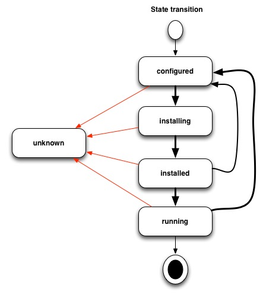

# Machine State Transitions

In Mayu, the machines have a state, which can vary depending on the operations that
are performed on them. The list of available states in Mayu is:

- `unknown`
- `installed`
- `installing`
- `configured`
- `running`

In the following, we show an image that illustrates the allowed transitions from
a origin state to a destination state.

